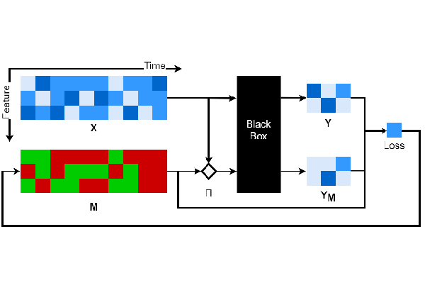

# Dynamask - Explaining Time Series Predictions with Dynamic Masks



Code Author: Jonathan Crabbé ([jc2133@cam.ac.uk](mailto:jc2133@cam.ac.uk))

This repository contains the implementation of Dynamask, a method to identify the features that are salient for
a model to issue its prediction when the data is represented in terms of time series.
For more details on the theoretical side, please read our [ICML 2021 paper](https://arxiv.org/abs/2106.05303): 'Explaining Time Series
Predictions with Dynamic Masks'.

Part of the experiments in our paper are relying on [FIT](https://github.com/sanatonek/time_series_explainability),
another repository associated to the [NeurIPS 2021 paper](https://papers.nips.cc/paper/2020/hash/08fa43588c2571ade19bc0fa5936e028-Abstract.html): 
'What went wrong and when? Instance-wise feature importance for time-series black-box models'. We have included all
the relevant files in the folder [fit](fit).

## Installation


To install the relevant packages from shell:
1. Clone the repository
2. Create a new virtual environment with Python 3.8
3. Run the following command from the repository folder:
    ```shell
    pip install -r requirements.txt #install requirements
    ```
    * If at this point you experience problems installing `psycopg2`, try `psycopg2-binary` (see comment in `requirements.txt`). Note also the dependencies for `psycopg2` installation here: https://www.psycopg.org/install/.

When the packages are installed, Dynamask can directly be used.

## Toy example

It is very easy to fit a mask on a time series model. Bellow, you can find a toy demonstration where we
fit a mask to an input time series. In this case, the mask area is fixed to 0.1 (the 10% most important features
are highlighted by the mask). All the relevant code can be found in the file [mask](attribution/mask.py).

```python
import torch
from attribution.mask import Mask
from attribution.perturbation import GaussianBlur
from utils.losses import mse

torch.manual_seed(42)
device = torch.device('cuda' if torch.cuda.is_available() else 'cpu')

# Define a pseudo-black box:
def black_box(input):
    output = input[-1, :]  # The black-box returns the features of the last time step
    return output
# Define a random input:
X = torch.randn(10, 3).to(device) # The shape of the input has to be (T, N_features)

# Fit a mask to the input with a Gaussian Blur perturbation:
pert = GaussianBlur(device)
mask = Mask(pert, device)
mask.fit(X, black_box, loss_function=mse, keep_ratio=0.1, size_reg_factor_init=0.01) # Select the 10% most important features

# Plot the resulting saliency map:
mask.plot_mask()
```

If the proportion of features to select is unknown, a good approach is to fit a group of masks
with different areas. Then, the extremal mask can be extracted from the group.
The relevant code can be found in the file [mask_group](attribution/mask_group.py).
```python
import torch
from attribution.mask_group import MaskGroup
from attribution.perturbation import GaussianBlur
from utils.losses import mse

torch.manual_seed(42)
device = torch.device('cuda' if torch.cuda.is_available() else 'cpu')

# Define a pseudo-black box:
def black_box(input):
    output = input[-1, :]  # The black-box returns the features of the last time step
    return output

# Define a random input:
X = torch.randn(10, 3).to(device) # The shape of the input has to be (T, N_features)

# Fit a group of masks to the input with a Gaussian Blur perturbation:
areas = [.1, .15, .2, .25] # These are the areas of the different masks
pert = GaussianBlur(device)
masks = MaskGroup(pert, device)
masks.fit(X, black_box, loss_function=mse, area_list=areas, size_reg_factor_init=0.01)

# Extract the extremal mask:
epsilon = 0.01
mask = masks.get_extremal_mask(threshold=epsilon)

# Plot the resulting saliency map:
mask.plot_mask()
```


## Replicate experiments

All experiments in the ICML paper can be replicated easily. The necessary code is in [experiments](experiments).
Bellow, we detail the procedure for each experiment.

Scripts to run the experiments are also provided: `experiments/run_<EXPERIMENT>.sh`.

###  Replicate the Rare experiments

1. Run the following command from the repository folder:
   ```shell
   python -m experiments.rare_feature # Runs the Rare Feature experiment
   python -m experiments.rare_time # Runs the Rare Time experiment
   ```
   To do the experiment with various seeds, please add the following specification to these commands:
   ```shell
   Options:
   --cv # An integer that sets the random seed (first run cv=0, second run cv=1, ...)
   ```
2. The results of these experiments are saved in the two following folders: [Rare Feature](experiments/results/rare_feature)
and [Rare Time](experiments/results/rare_time). To process the results and compute the associated metrics run:
   ```shell
   python -m experiments.results.rare_feature.get_results
   python -m experiments.results.rare_time.get_results
   ```
   The following options need to be specified:
   ```shell
   Options:
   --CV # The number of runs you have done for the experiment
   --explainers # The baselines you have used among: dynamask, fo, fp, ig, shap (separated by a space)
   ```


###  Replicate the State experiment

1. Run this command to generate the synthetic data and store it in ``data/state``:
   ```shell
   python -m fit.data_generator.state_data --signal_len 200 --signal_num 1000
   ```
2. Run the following command to fit a model together with a baseline saliency method:
   ```shell
   python -m fit.evaluation.baselines --explainer fit --train   
   ```
   To do the experiment with various baselines, please change the explainer:
   ```shell
   Options:
   --explainer # The baselines can be: fit, lime, retain, integrated_gradient, deep_lift, fo, afo, gradient_shap
   --train # Only put this option when fitting the FIRST baseline (this is to avoid retraining a model for each baseline); however, required for retain baseline
   --cv # An integer that sets the random seed (first run cv=0, second run cv=1, ...)
   ```
3. The models and baselines saliency maps are all saved in [this folder](experiments/results/state).
   Now fit a mask for each of these time series by running:
   ```shell
   python -m experiments.state
   ```
   Please use the same ``--cv`` option as for the previous command.


4. The masks are all saved in [this folder](experiments/results/state).
   To process the results and compute the associated metrics run:
   ```shell
   python -m experiments.results.state.get_results
   ```
   The following options need to be specified:
   ```shell
   Options:
   --CV # The number of runs you have done for the experiment
   --explainers # The baselines you have used among: dynamask, fo, afo, deep_lift, fit, gradient_shap, integrated_gradient, lime, retain (separated by a space)
   ```

### Replicate the MIMIC experiment
1. MIMIC-III is a private dataset. For the following, you need to have the MIMIC-III database running on
   a local server. For more information, please refer to [the official MIMIC-III documentation](https://mimic.mit.edu/iii/gettingstarted/dbsetup/).


2. Run this command to acquire the data and store it:
   ```shell
   python fit/data_generator/icu_mortality.py --sqluser YOUR_USER --sqlpass YOUR_PASSWORD
   ```
   If everything happens properly, two files named ``adult_icu_vital.gz`` and ``adult_icu_lab.gz`` 
   are stored in ``data/mimic``.
   

3. Run this command to preprocess the data: 
   ```shell
   python fit/data_generator/data_preprocess.py
   ```
   If everything happens properly, a file ``patient_vital_preprocessed.pkl`` is stored in ``data/mimic``. 

4. Run the following command to fit a model together with a baseline saliency method:
   ```shell
   python -m fit.evaluation.baselines --data mimic --explainer fit --train   
   ```
   To do the experiment with various baselines, please change the explainer:
   ```shell
   Options:
   --explainer # The baselines can be: fit, lime, retain, integrated_gradient, deep_lift, fo, afo, gradient_shap
   --train # Only put this option when fitting the FIRST baseline (this is to avoid retraining a model for each baseline); however, required for retain baseline
   --cv # An integer that sets the random seed (first run cv=0, second run cv=1, ...)
   ```

5. The models and baselines saliency maps are all saved in [this folder](experiments/results/state).
   Now fit a mask for each of these time series by running:
   ```shell
   python -m experiments.mimic
   ```
   Please use the same ``--cv`` option as for the previous command.
   ```shell
   Options:
   --cv # Same as in the previous command
   --area # The area of the mask to fit (a number between 0 and 1)
   ```

6. The masks are all saved in [this folder](experiments/results/mimic).
   To process the results and compute the associated metrics run:
   ```shell
   python -m experiments.results.state.plot_benchmarks
   ```
   The following options need to be specified:
   ```shell
   Options:
   --CV # The number of runs you have done for the experiment
   --explainers # The baselines you have used among: dynamask, fo, afo, deep_lift, fit, gradient_shap, integrated_gradient, lime, retain (separated by a space)
   --areas # The mask areas that you have computed (separated by a space)
   ```
   The resulting plots are saved in [this folder](experiments/results/mimic).

## Citing

If you use this code, please cite the associated paper:

```
@InProceedings{pmlr-v139-crabbe21a,
  title = 	 {Explaining Time Series Predictions with Dynamic Masks},
  author =       {Crabb{\'e}, Jonathan and Van Der Schaar, Mihaela},
  booktitle = 	 {Proceedings of the 38th International Conference on Machine Learning},
  pages = 	 {2166--2177},
  year = 	 {2021},
  editor = 	 {Meila, Marina and Zhang, Tong},
  volume = 	 {139},
  series = 	 {Proceedings of Machine Learning Research},
  month = 	 {18--24 Jul},
  publisher =    {PMLR},
  pdf = 	 {http://proceedings.mlr.press/v139/crabbe21a/crabbe21a.pdf},
  url = 	 {https://proceedings.mlr.press/v139/crabbe21a.html},
  abstract = 	 {How can we explain the predictions of a machine learning model? When the data is structured as a multivariate time series, this question induces additional difficulties such as the necessity for the explanation to embody the time dependency and the large number of inputs. To address these challenges, we propose dynamic masks (Dynamask). This method produces instance-wise importance scores for each feature at each time step by fitting a perturbation mask to the input sequence. In order to incorporate the time dependency of the data, Dynamask studies the effects of dynamic perturbation operators. In order to tackle the large number of inputs, we propose a scheme to make the feature selection parsimonious (to select no more feature than necessary) and legible (a notion that we detail by making a parallel with information theory). With synthetic and real-world data, we demonstrate that the dynamic underpinning of Dynamask, together with its parsimony, offer a neat improvement in the identification of feature importance over time. The modularity of Dynamask makes it ideal as a plug-in to increase the transparency of a wide range of machine learning models in areas such as medicine and finance, where time series are abundant.}
}
```
